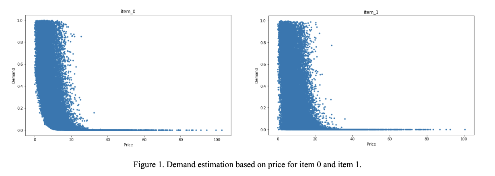
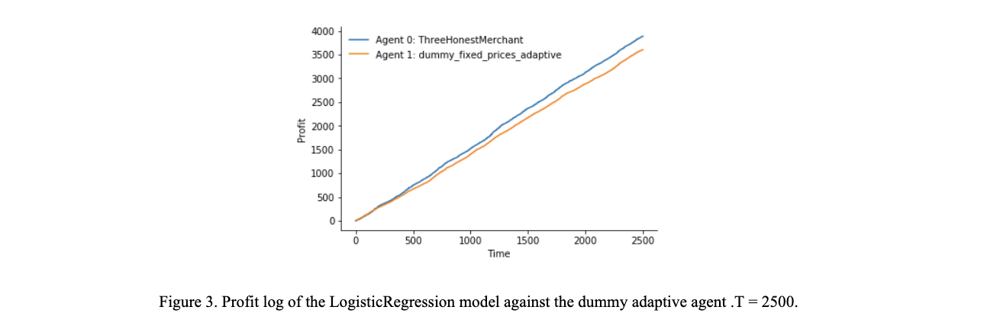
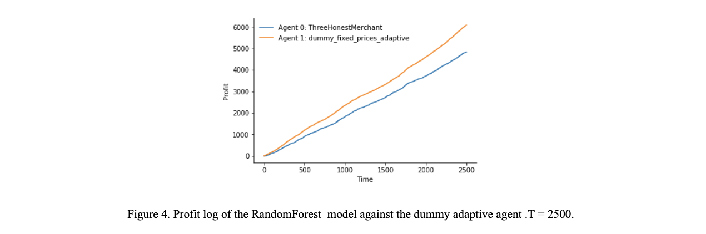
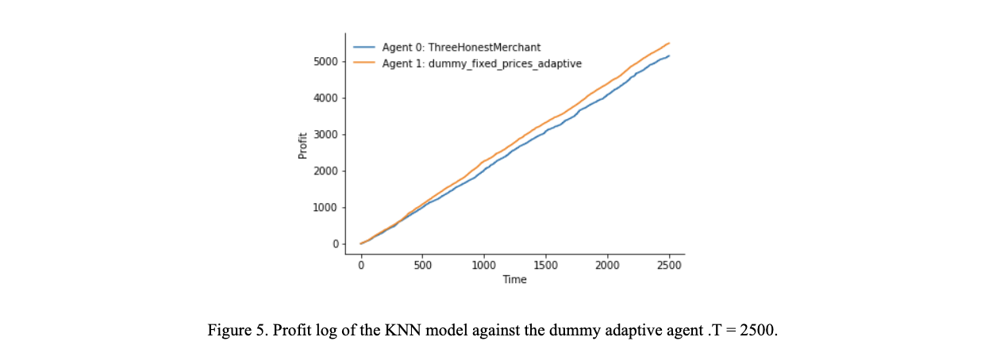

# Applied Data Science Pricing Competition

# INTRODUCTION
The purpose of this project was to participate in a class pricing competition based on the previous knowledge of demand estimation, revenue maximization, and pricing learned from the class. The project consists of two parts. Part one requires our team to come up with a pricing strategy based on the user valuation of an arbitrary product, opponent price, and history of sale. Part two requires our team to train a machine learning model and complete the tasks of demand estimation based on three user covariants, and revenue maximization to output the optimal price. Then based on this optimal price, we combine our strategy from part one to compete for customers. Each game will consist of two teams bidding prices for one customer without capacity constraints, the team with lower price under the valuation will win that round and gain revenue. Overall, the team with the most revenue across games will win the competition. As a result, we need to anticipate the moves of the opponent, and handle different situations with our algorithm. 

Specific techniques and strategies will be discussed extensively in the report below. 

# A: Demand estimation and price optimization (without competition)
For part two, demand estimation and price optimization, our goal was to train a machine learning model and complete the tasks of demand estimation based on three user covariants, and do revenue maximization to output the optimal price. Then based on this optimal price, we combine our strategy from part one to compete for customers.  
### Find Price Set and demand estimation
We built a logistic regression model, whose input was covariates and prices, and the output was -1, 0 or 1, which represented which item users bought. We trained the model using all the training data and got the demand result by using  predict_proba(). 
We wanted to find a set of prices which can be used in the calculation of max revenue. Thus, we plotted the demand curves of item_0 and item_1 which are shown below. We found that in the training set, for both item_0 and item_1, when the price goes larger than 30, the demand decreases to almost 0. Therefore, we set the price range to 0.1 to 30.

We finally sampled prices from 0.1 to 30 in intervals of 0.1 and got a price set with a size of 89401, the price set is shown below.

### Models and price optimization
#### LogisticRegression

Logistic Regression performed well overall with an average per-customer runtime of 0.271 second. It also beat the  dummy_fixed_prices_adaptive agent with T =2500, with a total profit of nearly 4000. All models were run against the dummy_fixed_prices_adaptive agent as a benchmark because we assume the opponent will be playing rationally most of the time, like this adaptive agent. Also other more advanced agents were not available for testing, so we compared our performance with this agent.  
#### Random Forest

Random Forest performed better than Logistic Regression but with an average per-customer runtime of 0.45 second. It didn’t beat the  dummy_fixed_prices_adaptive agent with T =2500, with a total profit of nearly 4500. In addition, the size of the random forest model is large, more than 30 Mb.  
#### KNN

KNN performed best among the three models but with a much longer average per-customer runtime of 1.78 second. It didn’t beat the  dummy_fixed_prices_adaptive agent with T =2500, with a total profit of over 5000. Due to the time complexity of the KNN model, we chose not to proceed with this approach.  

### Final Model: LogisticRegression
In our final model, we used logistics regression to predict the customer’s valuation for the two products. Even though the test accuracy of logistic regression was not as high as that of Random Forest, we still picked logistic regression since it gave us an acceptable accuracy and it took way less time than Random Forest to compute the customer covariates. In the contest, we had 500 mm for each step. We recorded the time for logistic regression and Random Forest, and we found that logistic regression is safely within the time requirement, but Random Forest was on the edge of time limit. To be conservative, we chose logistic regression to achieve a safer run time.

# B: Pricing under competition
For part one, we utilize the user valuation of each item for each game. We also observe the price the opponent gave and who the customer bought from the last round. From there we needed to anticipate the pricing strategy of the opponent and come up with our own pricing strategy that would ultimately produce the highest revenue. 

### Final Strategy for part 1: Dynamic Pricing based on Opponent Strategy
During one of the trial runs, we got negative revenue results. This could potentially be due to opponents playing evil and setting prices ridiculously high, or give negative prices occasionally, and skew our ɑ such that it becomes negative and we keep giving negative prices. This will result in a infinite loop of “winning” the customer because our price is lower, and it keeps lowering our ɑ, we then accumulate negative revenue.  
 

To combat this evil behavior and other similar behaviors, we implemented a series of steps that combines the best ideas from the previous iterations to ensure the best strategy: 
* Set a high price (close to valuation) on the first round. This is to set up the tone for cooperative play.
* Set up a checkpoint at round 100 to see if the opponent has been playing rational or not. We check by reverse engineering out the ɑ they could potentially be using. If their ɑ<0.5, we consider them playing evil and set our ɑ to 70% of theirs. 
* Every 100 rounds, reset ɑ if the team is playing nice. This strategy is used to prevent price war as well as increase opponent’s ɑ as discussed above.  
* When the valuation < 5, we return a crazy high price and let the opponent win that round while throwing them off. This strategy was discussed in the previous iteration. 
* For all other rounds, we check if the team is playing evil:
** Evil: when opponent’s last ɑ is too high (>1) or too low (<=0.85), or if their ɑ changed too dramatically from the round before the last round. 
** Not evil: when the opponent is playing rationally, not satisfying above criteria. 
* When the opponent is playing evil, we play adaptively, only adjust the price based on our own previous prices using self-adjusting ɑ like previous iterations. 
* When the opponent is playing rationally, we play tit-for-tat, we learn opponent’s previous ɑ and setting it as the β value, then undercut them by 0.9.   

Below are the results for running the final algorithm ThreeHonestMerchant against the dummy_fixed_prices_adaptive agent and the previous iterations, T = 2500.
